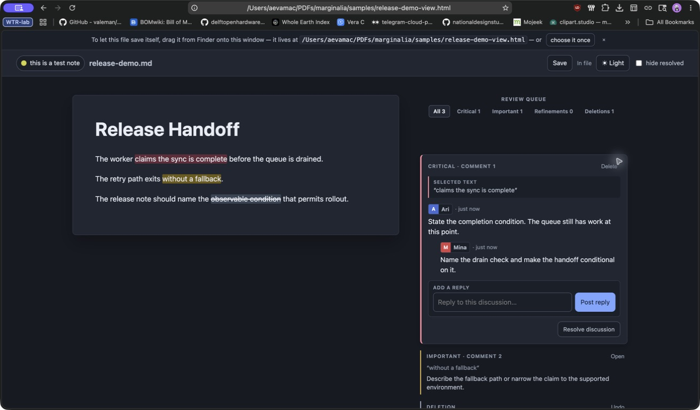
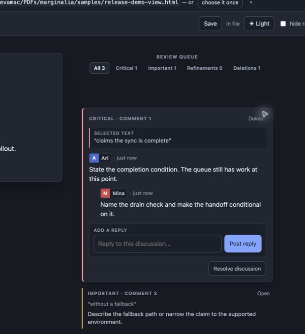

# Marginalia

Marginalia turns a Markdown file into a self-contained review document. A reviewer
opens one HTML file, selects exact text, records priority feedback or deletions,
and sends the file back. The receiving agent gets source addresses, intent, and
threaded discussion without re-ingesting the whole document as review context.

The viewer is offline and zero-server. It embeds the Markdown snapshot and review
ledger directly in the HTML, fetches nothing at runtime, and uses system fonts.

## Requirements

- Python 3.10 or newer. Runtime dependencies are Python standard library only.
- Any modern browser can review the generated HTML offline.
- Chromium is recommended when the reviewer needs in-place saving. Helium, Chrome,
  Edge, and Brave expose the required File System Access API.

## In Use

The source remains readable on the left. The margin carries priority, the exact
selected text, reviewer signatures, a focused discussion, and direct deletion
instructions without covering the document.



The focused thread keeps authors legible without using profile pictures. Priority
belongs to the card edge and source mark; reviewer identity belongs to the
rectangular signature stamp.



## Release Demo

The checked-in [release fixture](samples/release-demo.md) and
[review ledger](samples/release-demo.notes.json) reproduce the screenshots and
the full AI return path:

```sh
./scripts/build-release-demo.sh
open -a Helium samples/release-demo-view.html
python3 distill.py samples/release-demo-view.html
python3 distill.py --packet samples/release-demo-view.html
```

The rendered demo contains a Critical discussion with two reviewers, an Important
note, and a Strike deletion. The text digest returns source line addresses; the
packet returns the same operations as structured JSON without copying the source.

## Review Loop

```text
plan.md -> plan-view.html -> reviewer -> digest or revision packet -> revised plan.md
```

1. Bake a source file:

   ```sh
   python3 build-view.py plan.md
   ```

2. Open `plan-view.html` in a browser. Chromium browsers, including Helium, can
   save it in place after the reviewer drags the file onto its own window once.
   Firefox and Safari fall back to a downloaded replacement file.

3. Select a span and choose a review signal:

   | Signal | Meaning | Shortcut |
   | --- | --- | --- |
   | Critical | Mission-critical correction | `1` |
   | Important | Fix before another unnecessary iteration | `2` |
   | Refinement | Low-risk polish or clarification | `3` |
   | Strike | Delete the selected text | `X` |

   Priority notes automatically colour their source span. Strike creates a direct
   deletion operation. Every coloured span has an explicit review intent.

4. Post the comment, reply in the focused discussion when needed, then save the
   view. The review queue filters Critical, Important, Refinements, and Deletions.

5. Collect the feedback:

   ```sh
   python3 distill.py plan-view.html
   python3 distill.py --packet plan-view.html
   ```

   The digest is human-readable. The revision packet is structured JSON for an
   agent that can read the current Markdown source. Neither duplicates the full
   source text merely to carry the review.

   Collection options:

   ```text
   --all             include resolved notes
   --context=N       include N source lines around each located note
   --source=PATH     use this Markdown file as the current source
   --no-sidecar      suppress the derived <doc>.notes.json ledger
   --packet          emit structured operations for an agent
   ```

6. Revise the Markdown, then bake it again. Existing notes carry forward. A span
   whose reviewed text no longer locates stays visible as `text changed`; select
   the replacement span in the viewer and use Reattach instead of guessing.

## Review Data

The HTML file is the review artifact passed between people. Running `distill.py`
also writes `<doc>.notes.json`, a git-friendly ledger with the document hash,
notes, and extraction time. Commit sidecars when review history belongs in the
repository.

Parallel reviews merge without overwriting one another:

```sh
python3 merge-ledgers.py reviewer-a.notes.json reviewer-b.notes.json \
  --out plan.notes.json --view plan-view.html
```

The merge accepts only sidecars for the same Markdown snapshot. Independent notes
are preserved, shared threads union by entry ID, and a note remains open until all
copies resolve it.

## Agent Skills

Marginalia is a set of agent skills packaged as a Claude Code plugin. The same
canonical skill folders also install directly into Codex:

```sh
./scripts/install-agent-skills.sh
```

The installer creates symlinks and refuses to replace an existing local skill.
Restart the relevant agent after installation.

| Agent | Installed form | Commands |
| --- | --- | --- |
| Claude Code | Local `marginalia` plugin | `/margin-send`, `/margin-collect`, `/margin-merge` |
| Codex | Direct local skills | `margin-send`, `margin-collect`, `margin-merge` |

For a one-off Claude Code session without installation:

```sh
claude --plugin-dir "$PWD"
```

## Browser Behaviour

The viewer follows the operating-system theme by default and remembers a manual
theme choice. It autosaves locally, warns before closing with unsaved work, and
supports `Cmd+S`.

Chromium’s File System Access API controls in-place saving. The browser chooses
the first-save folder, but after the view is armed with its own file handle, later
saves write directly back to that file. The viewer cannot override Chromium’s
folder-picker policy.

The browser keeps unsaved review state in local storage for the same view file on
the same machine. The saved HTML remains the portable artifact sent to another
reviewer. Marginalia makes no network requests at runtime.

## Repository Layout

```text
build-view.py       bake Markdown into a standalone viewer
template.html       viewer UI and embedded client logic
distill.py          digest, packet, staleness, and sidecar output
merge-ledgers.py    merge parallel sidecars safely
margin_anchor.py    quote anchoring and Markdown source mapping
skills/             send, collect, and merge workflows for agents
samples/            maintained Markdown example
tests/              Python and Node verification
```

## Verification

```sh
python3 -m pytest tests/
node --test tests/*.mjs
```
