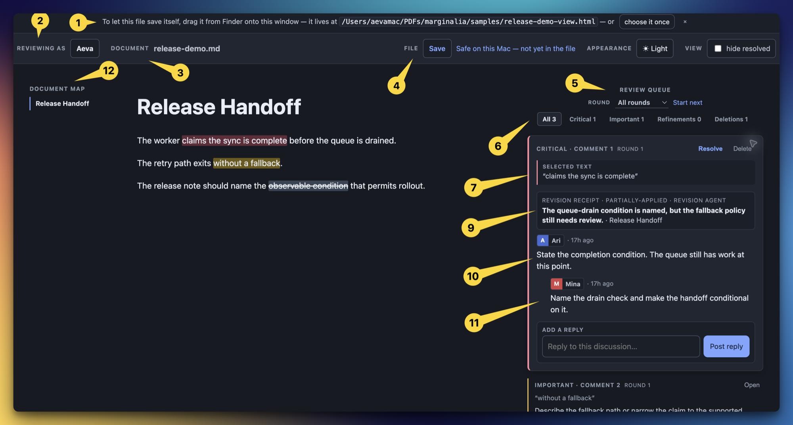
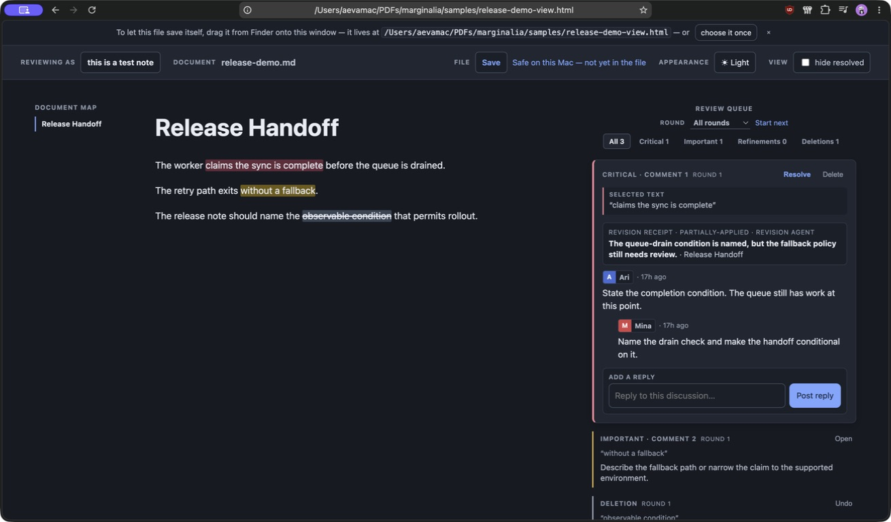

# Marginalia

<p align="center">
  
</p>

**A portable review pass for Markdown that returns precise human feedback to an
AI without repeatedly re-ingesting the entire document.**

Marginalia bakes a Markdown file into one self-contained HTML review document.
Anyone can open that file locally, select exact text, record a priority note or a
deletion, reply in context, and send the same file back. The author or an AI then
receives a compact digest or structured revision packet with the feedback's
location, intent, and discussion intact.

The baked viewer renders standard Markdown, local images, and inline or display
LaTeX with KaTeX. Images preserve their original aspect ratio and downscale to
the reading column; equations, fonts, and the renderer itself stay inside the
offline HTML file.



The numbered view shows the complete handoff in one frame:

| Callout | What it shows |
| --- | --- |
| 1 | The one-time file arming control used for in-place saves. |
| 2 | The persistent review toolbar. |
| 3 | The Markdown document being reviewed. |
| 4 | File save and browser-local recovery state. |
| 5 | The review queue and round controls. |
| 6 | Priority filters for Critical, Important, Refinement, and Deletion work. |
| 7 | The exact source passage attached to the open discussion. |
| 9 | A revision receipt recording what an agent changed and what remains. |
| 10 | Distinct reviewer signatures and the discussion they produced. |
| 11 | The reply composer for continuing the source-linked discussion. |
| 12 | The heading-derived document map. |

## The Problem

Reviewing AI-generated plans, specifications, drafts, and ordinary text usually
falls into one of two bad loops:

1. A reviewer gives feedback in chat, where the comment becomes detached from the
   exact passage it concerns.
2. The entire document is pasted back into an AI conversation for every revision,
   spending context on material that has not changed and leaving the agent to infer
   what a vague comment refers to.

Comments in Google Docs, Word, or an editor solve the first half of that problem
for people. They do not provide a compact, reliable return format for an AI, and
they often assume every reviewer shares one application, account, or server.

Marginalia keeps the two jobs separate:

- **The Markdown file remains the source of truth.** Any editor, repository, or
  agent can own it.
- **The baked HTML file is the review artifact.** It travels by email, AirDrop,
  chat attachment, USB stick, or git without a server.
- **The digest or revision packet is the AI return leg.** It carries only the
  operations that matter, anchored to the source, instead of a second copy of the
  document.

This is a review system, not a replacement Markdown editor or a general-purpose
team workspace. It is useful when a human needs to correct an agent's output with
more precision and less prompting.

## What the Workflow Looks Like

```text
author or AI writes Markdown
          |
          v
build-view.py creates one portable review HTML file
          |
          v
reviewers select text, leave priority notes, reply, resolve, or strike text
          |
          v
distill.py returns a digest or compact revision packet
          |
          v
author or AI revises the original Markdown and bakes the next review pass
```

The reviewer never needs the repository or the source Markdown just to annotate.
The receiving agent can work from a small feedback packet when it already has
access to the current source file.

## Desktop Review Workspace

Wide desktop views keep three kinds of context visible at once:

```text
Document map                 Markdown source                    Review queue
where am I?                  what am I reading?                 what needs work?
```

The left map is generated from rendered Markdown headings. It scrolls to the
selected section and follows the section being read. The centre remains the
Markdown document. The right margin holds the priority queue, threads, receipts,
rounds, and source-linked notes. The map collapses only when the viewport cannot
keep all three columns readable.

The top strip names the state of each control: **Reviewing as** identifies the
author for new notes and replies, **Document** names the source being reviewed,
**File** distinguishes an on-disk save from a browser-local draft, **Appearance**
changes the theme, and **View** controls whether resolved discussions remain
visible. The **Reading** controls above the document map change only the reading
column. They return to the top strip when the map collapses at narrower widths.
Text size is remembered on the current Mac and never changes the shared review
file or another reviewer's view.

## Requirements

- Python 3.10 or newer. Runtime dependencies are Python standard library only.
- A modern browser to review the generated HTML offline.
- Chromium is recommended for in-place saving: Helium, Chrome, Edge, and Brave
  expose the File System Access API used by the self-saving flow.
- Node.js 18 or newer is needed only for the optional npm-installed command.

No server, database, account, API key, or network request is needed at review
time.

## Install

Install the command globally from npm:

```sh
npm install -g marginalia-md
marginalia --help
```

The npm package contains the viewer, Python review engine, agent skills, sample
documents, and release fixture. Python 3.10 or newer must still be available on
`PATH`; the Node launcher finds it and delegates to the bundled scripts.

Run the packaged demo as a smoke test:

```sh
marginalia demo
```

The command prints the full path to `release-demo-view.html`. Open that file in
Helium, Chrome, Edge, or Brave.

### Install from Source

Clone the repository when developing Marginalia itself:

```sh
git clone https://github.com/nomanfoundhere/marginalia.git
cd marginalia
```

Expose that checkout as the global development command:

```sh
npm link
marginalia --help
```

`npm link` creates a global symlink to the checkout, so subsequent `marginalia`
commands run the files you are editing. Cloning alone intentionally does not add
repository scripts to your shell `PATH`.

Run a direct smoke test:

```sh
python3 build-view.py samples/demo.md
open -a Helium samples/demo-view.html
```

### Install the Agent Skills

Marginalia is four agent skills, packaged together as a Claude Code plugin:

- `margin-send`: bake and open a Markdown file for review.
- `margin-collect`: read a view back as a digest or revision packet and act on it.
- `margin-merge`: combine parallel reviewer ledgers safely.
- `margin-receipt`: record what a revision agent changed without closing the
  reviewer’s note on its own.

An npm installation can install all skills globally for the current user:

```sh
marginalia skills
```

From a source checkout, run the same installer directly:

```sh
./scripts/install-agent-skills.sh
```

The installer creates symlinks and refuses to replace an existing local path.
Restart Claude Code and Codex after installation.

| Agent | Installed form | Use it as |
| --- | --- | --- |
| Claude Code | Local `marginalia` plugin at `~/.claude/skills/marginalia` | `/margin-send`, `/margin-collect`, `/margin-merge`, `/margin-receipt` |
| Codex | Local skills in `~/.codex/skills/` | Ask Codex to use `margin-send`, `margin-collect`, `margin-merge`, or `margin-receipt` |

For a one-off Claude Code session without installing anything globally:

```sh
claude --plugin-dir "$PWD"
```

## Quick Start

Assume the document is `plan.md`.

### 1. Bake the review file

```sh
marginalia build plan.md
```

This writes `plan-view.html` next to the Markdown source. The file embeds a source
snapshot and note ledger, so it can be shared as one offline review document.

### 2. Review it

Open `plan-view.html` locally. Select any passage and choose one of the following
signals:

| Signal | Meaning | Source mark | Shortcut |
| --- | --- | --- | --- |
| Critical | Mission-critical correction. The draft should not proceed unchanged. | Red | `1` |
| Important | Fix before another unnecessary iteration. | Amber | `2` |
| Refinement | Lower-risk polish, clarification, or follow-up. | Blue | `3` |
| Strike | Delete the selected text. | Strikethrough | `X` |

Priority signals open a draft comment and apply the matching source highlight.
Strike creates a direct deletion instruction, with no comment required. Marginalia
does not create wordless generic highlights: every coloured span carries a review
intent.

Post the note, then use the focused thread to add replies. The margin filters All,
Critical, Important, Refinements, and Deletions. One discussion expands at a time
while the rest stay compact and aligned to their source spans.

On a wide desktop, the map on the left follows Markdown headings while the review
queue stays on the right. The map only navigates the document: priority and round
filters remain review controls in the right margin.

### 3. Save the review file

Chromium browsers support the smooth path:

1. Drag `plan-view.html` from Finder onto its own browser window once, or choose
   the same file through the inline first-save control.
2. The browser grants a handle to that exact file.
3. Later Save clicks and `Cmd+S` write back to the same HTML file.

Chromium controls the initial file-picker folder. The browser does not expose a
reliable API for an HTML file to choose a different folder on the user's behalf.

Firefox and Safari cannot grant an in-place file handle. Save triggers a download
of the updated `-view.html`, which replaces the prior copy manually.

The viewer also autosaves to browser-local storage and warns before closing with
unsaved work. That cache protects the local reviewer only; saving the HTML is what
makes review work portable.

### 4. Return the feedback to the author or AI

For a readable terminal digest:

```sh
marginalia collect plan-view.html
```

For an agent that can already read `plan.md`, use the compact structured packet:

```sh
marginalia packet plan-view.html
```

The packet contains operations such as `note` and `delete`, priority, author,
thread messages, quote plus prefix/suffix anchor, reviewed and current source
locations, and source hashes. It does **not** duplicate the document text.

After revision, rebuild the view from the Markdown source:

```sh
marginalia build plan.md
```

Existing notes carry forward. Their source anchors are checked against the newly
baked Markdown snapshot.

### Record What Changed

Revision agents do not resolve reviewer notes. They attach a receipt instead:
what changed, what was declined, or what still needs clarification. The reviewer
keeps control of resolution, while the next pass can see the prior decision.

```sh
marginalia receipt plan-view.html receipts.json --author "Revision agent" --source plan.md
```

`receipts.json` is a JSON list (or `{ "receipts": [...] }`) containing a note
ID, outcome (`applied`, `partially-applied`, `declined`, or
`needs-clarification`), and a reason. A successful receipt does not alter the
note’s `resolved` state.

### Review Rounds and Sections

The rail can start a new review round without erasing the earlier one. Its round
and section controls let a reviewer narrow the queue to the work that belongs to
the current pass. Packets retain a note’s review round, heading path at review
time, current heading path, and revision receipts. An agent can therefore
distinguish a new request from an older one that has already been addressed.

## When the Source Changes

An AI or author can change the Markdown after a review pass. A comment should not
silently jump to another similar sentence just because the original moved.

Marginalia stores the selected quote with prefix and suffix context. On rebuild and
collection it tries to locate that span in the source. The result is explicit:

- **Located:** the digest gives a current source line address.
- **Text changed / unlocated:** the note remains visible with its original quote.
  Select the replacement passage in the viewer and use **Reattach**. The system
  never guesses a new target for a reviewer.
- **Source diverged:** the digest and packet mark that the current Markdown differs
  from the reviewed snapshot, so the receiving agent verifies the span before
  editing.

This is why the feedback remains useful after one revision without pretending that
an anchor is infallible.

## Parallel Reviewers

Make one named copy per reviewer before sending the view around. Separate files
avoid accidental overwrites and make the sidecars unambiguous:

```sh
bash scripts/prepare-review-copies.sh plan-view.html aria mina
```

Running `distill.py` also writes `<doc>.notes.json`: a git-friendly derived ledger
containing the source hash and notes. Commit it when review history belongs in the
repository.

Merge sidecars from independent reviewers only when they refer to the same source
snapshot:

```sh
marginalia merge reviewer-a.notes.json reviewer-b.notes.json \
  --out plan.notes.json --view plan-view.html
```

The merge keeps independent notes, unions messages for the same globally identified
note, retains the highest priority if copies disagree, and leaves a note unresolved
until every copy resolves it. It refuses to inject the merged ledger into a view
whose embedded Markdown snapshot has a different hash.

The sidecar is review history, not a second source of truth. Importing it into a
view is always explicit through `--view`.

## Collection Reference

```text
marginalia collect [--all] [--priority=TAGS] [--status] [--context=N] [--source=PATH] [--no-sidecar] <doc-view.html>
marginalia packet  [--all] [--priority=TAGS] [--status] [--context=N] [--source=PATH] [--no-sidecar] <doc-view.html>
```

| Option | Effect |
| --- | --- |
| `--all` | Include resolved notes. |
| `--priority=TAGS` | Include only comma-separated `critical`, `important`, `refinement`, or `delete` notes. |
| `--status` | Print the review-status summary as JSON. |
| `--context=N` | Include `N` surrounding source lines for each located note. |
| `--source=PATH` | Use an explicit current Markdown file rather than the sibling source. |
| `--packet` | Emit JSON operations for an agent. |
| `--no-sidecar` | Do not write the derived `<doc>.notes.json` ledger. |

The digest is the default review payload for a human or an agent that only needs
the requested changes. The source file enters AI context only when the agent must
actually revise it.

## Release Demo

The checked-in [release fixture](samples/release-demo.md) and
[review ledger](samples/release-demo.notes.json) reproduce the screenshots and the
complete return path. An npm installation can build the fixture with:

```sh
marginalia demo
```

The command prints the generated HTML path. From a source checkout, the complete
demo sequence is:

```sh
./scripts/build-release-demo.sh
open -a Helium samples/release-demo-view.html
python3 distill.py --no-sidecar samples/release-demo-view.html
python3 distill.py --packet --no-sidecar samples/release-demo-view.html
```

The demo contains a Critical two-reviewer discussion with a revision receipt, an
Important note, a Strike deletion, a first review round, the desktop document map,
and labelled toolbar states.



## Data, Privacy, and Boundaries

- The baked view contains the reviewed Markdown snapshot and review ledger as
  base64-encoded blocks. It runs without a network connection.
- The viewer makes no runtime network requests and sends no review data anywhere.
- Browser-local autosave is per browser profile and per document name. It is a
  recovery aid, not collaboration storage.
- The saved HTML is the portable handoff between reviewers.
- The Markdown source remains the document that authors and agents edit.
- The sidecar ledger is optional, derived review history for git and parallel
  merge, never a hidden replacement for the Markdown source.

## Repository Map

```text
template.html                    viewer UI and client-side review logic
build-view.py                    bakes Markdown into a standalone view
distill.py                       digest, revision packet, staleness, sidecar output
merge-ledgers.py                 safe parallel-sidecar merge and explicit import
record-receipts.py               agent revision outcomes without auto-resolving notes
margin_anchor.py                 quote anchoring and Markdown source mapping
skills/                          Claude Code and Codex review workflows
samples/                         minimal and release-demo fixtures
docs/screenshots/                checked-in release screenshots
docs/assets/                     project artwork and app icon
tests/                           Python and Node verification
```

## Development Verification

```sh
npm test
npm pack --dry-run
claude plugins validate .
```

The release-demo builder also verifies, through the real merge/import path, that
its ledger belongs to the source it embeds.
